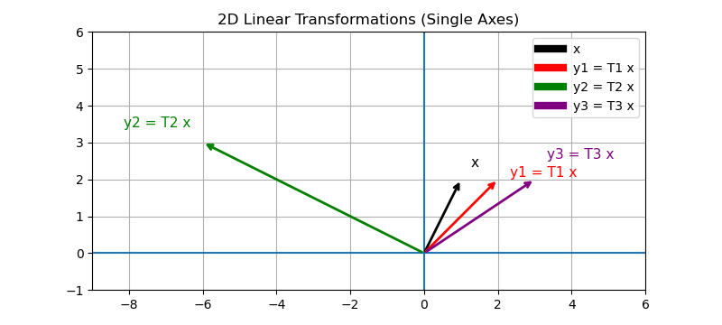

### Question 1 — From Equations to Matrix Form (10 Points)

Consider the following system of four equations in four unknowns:

$$
\begin{aligned}
2x_1 - x_2 + 0x_3 + 3x_4 &= 7 \\
-4x_1 + 5x_2 + x_3 - 2x_4 &= -6 \\
x_1 + 2x_2 + 4x_3 + 0x_4 &= 10 \\
0x_1 - 3x_2 + 2x_3 + x_4 &= 1
\end{aligned}
$$

1. Write the system in matrix form $\mathbf{A}\mathbf{x}=\mathbf{b}$.
2. Clearly identify $\mathbf{A}$, $\mathbf{x}$, and $\mathbf{b}$.
3. State the dimensions of $\mathbf{A}$, $\mathbf{x}$, and $\mathbf{b}$.

---

### Solution for Question 1

1. Write the system in matrix form $\mathbf{A}\mathbf{x}=\mathbf{b}$.

$$
\begin{bmatrix}
2 & -1 & 0 & 3 \\
-4 & 5 & 1 & -2 \\
1 & 2 & 4 & 0 \\
0 & -3 & 2 & 1
\end{bmatrix}
\begin{bmatrix}
x_1\\x_2\\x_3\\x_4
\end{bmatrix}
=
\begin{bmatrix}
7\\-6\\10\\1
\end{bmatrix}
$$

2. Clearly identify $\mathbf{A}$, $\mathbf{x}$, and $\mathbf{b}$.

$$
\mathbf{A}=
\begin{bmatrix}
2 & -1 & 0 & 3 \\
-4 & 5 & 1 & -2 \\
1 & 2 & 4 & 0 \\
0 & -3 & 2 & 1
\end{bmatrix},
\quad
\mathbf{x}=
\begin{bmatrix}
x_1\\x_2\\x_3\\x_4
\end{bmatrix},
\quad
\mathbf{b}=
\begin{bmatrix}
7\\-6\\10\\1
\end{bmatrix}
$$

3. State the dimensions of $\mathbf{A}$, $\mathbf{x}$, and $\mathbf{b}$.

- $\mathbf{A}$ is $4\times 4$
- $\mathbf{x}$ is $4\times 1$
- $\mathbf{b}$ is $4\times 1$

---

### Question 2 — 2D Linear Transformations (10 Points)

Let the vector

$$
\mathbf{x}=
\begin{bmatrix}
1\\
2
\end{bmatrix}
$$

Consider the following three transformation matrices:

$$
\mathbf{T}_1=
\begin{bmatrix}
2 & 0\\
0 & 1
\end{bmatrix}
\qquad
\mathbf{T}_2=
\begin{bmatrix}
0 & -3\\
3 & 0
\end{bmatrix}
\qquad
\mathbf{T}_3=
\begin{bmatrix}
1 & 1\\
0 & 1
\end{bmatrix}
$$

1. Compute $\mathbf{y}_k=\mathbf{T}_k\mathbf{x}$ for $k=1,2,3$.
2. On a single set of axes, sketch the original vector $\mathbf{x}$ and the three transformed vectors
   $\mathbf{y}_1,\mathbf{y}_2,\mathbf{y}_3$.

---

### Solution for Question 2

1. Compute $\mathbf{y}_k=\mathbf{T}_k\mathbf{x}$ for $k=1,2,3$.

$$
\mathbf{y}_1=\mathbf{T}_1\mathbf{x}
=
\begin{bmatrix}
2 & 0\\
0 & 1
\end{bmatrix}
\begin{bmatrix}
1\\2
\end{bmatrix}
=
\begin{bmatrix}
2\\2
\end{bmatrix}
$$

$$
\mathbf{y}_2=\mathbf{T}_2\mathbf{x}
=
\begin{bmatrix}
0 & -3\\
3 & 0
\end{bmatrix}
\begin{bmatrix}
1\\2
\end{bmatrix}
=
\begin{bmatrix}
-6\\3
\end{bmatrix}
$$

$$
\mathbf{y}_3=\mathbf{T}_3\mathbf{x}
=
\begin{bmatrix}
1 & 1\\
1 & 0
\end{bmatrix}
\begin{bmatrix}
1\\2
\end{bmatrix}
=
\begin{bmatrix}
3\\2
\end{bmatrix}
$$

2. On a single set of axes, sketch the original vector $\mathbf{x}$ and the three transformed vectors
   $\mathbf{y}_1,\mathbf{y}_2,\mathbf{y}_3$.

---

### Question 3 — Matrix Multiplication (10 Points)

Let

$$
\mathbf{A}=
\begin{bmatrix}
1 & -2 \\
0 & 3 \\
4 & 1 \\
-1 & 2
\end{bmatrix}
\qquad
\mathbf{B}=
\begin{bmatrix}
2 & 0 & -1 & 3 & 1 \\
-2 & 4 & 5 & 0 & -3
\end{bmatrix}
$$

1. State the dimensions of $\mathbf{A}$, $\mathbf{B}$, and $\mathbf{A}\mathbf{B}$.
2. Compute the product $\mathbf{C}=\mathbf{A}\mathbf{B}$.
3. Show your work clearly for **two entries** of $\mathbf{C}$:
   - $c_{11}$
   - $c_{34}$

---

### Solution for Question 3

1. State the dimensions of $\mathbf{A}$, $\mathbf{B}$, and $\mathbf{A}\mathbf{B}$.

- $\mathbf{A}$ is $4\times 2$
- $\mathbf{B}$ is $2\times 5$
- $\mathbf{A}\mathbf{B}$ is $4\times 5$

2. Compute the product $\mathbf{C}=\mathbf{A}\mathbf{B}$.

$$
\mathbf{C}=\mathbf{A}\mathbf{B}
=
\begin{bmatrix}
1 & -2 \\
0 & 3 \\
4 & 1 \\
-1 & 2
\end{bmatrix}
\begin{bmatrix}
2 & 0 & -1 & 3 & 1 \\
-2 & 4 & 5 & 0 & -3
\end{bmatrix}
=
\begin{bmatrix}
6 & -8 & -11 & 3 & 7 \\
-6 & 12 & 15 & 0 & -9 \\
6 & 4 & 1 & 12 & 1\\
-6 & 8 & 11 & -3 & 7\\
\end{bmatrix}
$$

3. Show your work clearly for **two entries** of $\mathbf{C}$:
   - $c_{11} = 1 * 2 + (-2) * (-2) = 6$
   - $c_{34} = 4 * 3 + 1 * 0 = 12$

---

### Question 4 — Block Matrix Multiplication (10 Points)

Consider the matrices

$$
\mathbf{K}\in\mathbb{R}^{6\times 6}
\qquad
\mathbf{X}\in\mathbb{R}^{6\times 3}
$$

Matrix $\mathbf{K}$ is partitioned into four blocks:

- $\mathbf{K}_{11}\in\mathbb{R}^{4\times 4}$
- $\mathbf{K}_{12}\in\mathbb{R}^{4\times 2}$
- $\mathbf{K}_{21}\in\mathbb{R}^{2\times 4}$
- $\mathbf{K}_{22}\in\mathbb{R}^{2\times 2}$

and matrix $\mathbf{X}$ is partitioned compatibly as:

- $\mathbf{X}_1\in\mathbb{R}^{4\times 3}$
- $\mathbf{X}_2\in\mathbb{R}^{2\times 3}$

1. Sketch out the partitioning on the matrices (you dont need to write out all the entries). Write the **partitioned
   forms** of $\mathbf{K}$ and $\mathbf{X}$ using block notation,

2. Write the block multiplication expression for

   $$
   \mathbf{Y}=\mathbf{K}\mathbf{X}
   $$

   in terms of the submatrices.

3. For each product appearing in your expression, state its dimensions. For example:

   $$
   \mathbf{K}_{12}\mathbf{X}_2:\quad (4\times 2)(2\times 3)=(4\times 3)
   $$

4. State the final dimension of $\mathbf{Y}$.

You do **not** need to perform any numerical multiplication — the goal is to correctly set up the block multiplication
and verify dimensional consistency.

---

### Solution for Question 4

1. Sketch out the partitioning on the matrices (you dont need to write out all the entries). Write the **partitioned
   forms** of $\mathbf{K}$ and $\mathbf{X}$ using block notation,

$$
\mathbf{K}=
\left[
\begin{array}{cccc|cc}
k_{11} & k_{12} & k_{13} & k_{14} & k_{15} & k_{16} \\
k_{21} & k_{22} & k_{23} & k_{24} & k_{25} & k_{26} \\
k_{31} & k_{32} & k_{33} & k_{34} & k_{35} & k_{36} \\
k_{41} & k_{42} & k_{43} & k_{44} & k_{45} & k_{46} \\
\hline
k_{51} & k_{52} & k_{53} & k_{54} & k_{55} & k_{56} \\
k_{61} & k_{62} & k_{63} & k_{64} & k_{65} & k_{66} \\
\end{array}
\right]
=
\begin{bmatrix}
\mathbf{K}_{11} & \mathbf{K}_{12}\\
\mathbf{K}_{21} & \mathbf{K}_{22}
\end{bmatrix},
\quad
\mathbf{K}_{11}\in\mathbb{R}^{4\times4},\;
\mathbf{K}_{12}\in\mathbb{R}^{4\times2},\;
\mathbf{K}_{21}\in\mathbb{R}^{2\times4},\;
\mathbf{K}_{22}\in\mathbb{R}^{2\times2}.
$$

$$
\mathbf{X}=
\left[
\begin{array}{ccc}
x_{11} & x_{12} & x_{13}\\
x_{21} & x_{22} & x_{23}\\
x_{31} & x_{32} & x_{33}\\
x_{41} & x_{42} & x_{43}\\
\hline
x_{51} & x_{52} & x_{53}\\
x_{61} & x_{62} & x_{63}
\end{array}
\right]
=
\mathbf{X}=
\begin{bmatrix}
\mathbf{X}_1\\
\mathbf{X}_2
\end{bmatrix},
\quad
\mathbf{X}_1\in\mathbb{R}^{4\times3},\;
\mathbf{X}_2\in\mathbb{R}^{2\times3}.
$$

2. Write the block multiplication expression for

   $$
   \mathbf{Y}=\mathbf{K}\mathbf{X}
   $$

   in terms of the submatrices.

$$
\mathbf{Y}=\mathbf{K}\mathbf{X}
=
\begin{bmatrix}
\mathbf{K}_{11} & \mathbf{K}_{12}\\
\mathbf{K}_{21} & \mathbf{K}_{22}
\end{bmatrix}
\begin{bmatrix}
\mathbf{X}_1\\
\mathbf{X}_2
\end{bmatrix}
=
\begin{bmatrix}
\mathbf{K}_{11}\mathbf{X}_1+\mathbf{K}_{12}\mathbf{X}_2\\
\mathbf{K}_{21}\mathbf{X}_1+\mathbf{K}_{22}\mathbf{X}_2
\end{bmatrix}.
$$

3. For each product appearing in your expression, state its dimensions.

$$
\mathbf{K}_{11}\mathbf{X}_1:\quad (4\times 4)(4\times 3)=(4\times 3)
$$

$$
\mathbf{K}_{12}\mathbf{X}_2:\quad (4\times 2)(2\times 3)=(4\times 3)
$$

$$
\mathbf{K}_{21}\mathbf{X}_1:\quad (2\times 4)(4\times 3)=(2\times 3)
$$

$$
\mathbf{K}_{22}\mathbf{X}_2:\quad (2\times 2)(2\times 3)=(2\times 3)
$$

4. State the final dimension of $\mathbf{Y}$.

$$
\mathbf{Y}:\quad (6\times 6)(6\times 3)=(6\times 3)
$$

---

### Question 5 — Gauss–Jordan (10 Points)

Let

$$
\mathbf{A}=
\begin{bmatrix}
2 & 1 & 0 & 1 \\
1 & 3 & 1 & 0 \\
0 & 2 & 4 & 1 \\
1 & 0 & 1 & 2
\end{bmatrix}
\qquad
\mathbf{b}=
\begin{bmatrix}
1\\2\\3\\4
\end{bmatrix}
$$

1. Form the augmented matrix $[\mathbf{A}\,|\,\mathbf{I}]$.
2. Perform Gauss–Jordan elimination **only through the first two pivots** (i.e., make the first two pivot columns match
   $\mathbf{I}$).
3. Clearly show your row operations and the partially reduced matrix.

---

### Solution for Question 5

1. Form the augmented matrix $[\mathbf{A}\,|\,\mathbf{I}]$.

$$
\mathbf{[A|I]}=
\left[
\begin{array}{cccc|cccc}
2 & 1 & 0 & 1 & 1 & 0 & 0 & 0\\
1 & 3 & 1 & 0 & 0 & 1 & 0 & 0\\
0 & 2 & 4 & 1 & 0 & 0 & 1 & 0\\
1 & 0 & 1 & 2 & 0 & 0 & 0 & 1
\end{array}
\right]
$$

2. Perform Gauss–Jordan elimination **only through the first two pivots** (i.e., make the first two pivot columns match
   $\mathbf{I}$).

3. Clearly show your row operations and the partially reduced matrix.

**Pivot 1 (column 1):**
Row operation:

- $R_1 \leftarrow \frac{1}{2}R_1$

$$
\left[
\begin{array}{cccc|cccc}
1 & 0.5 & 0 & 0.5 & 0.5 & 0 & 0 & 0\\
1 & 3 & 1 & 0 & 0 & 1 & 0 & 0\\
0 & 2 & 4 & 1 & 0 & 0 & 1 & 0\\
1 & 0 & 1 & 2 & 0 & 0 & 0 & 1
\end{array}
\right]
$$

- $R_2 \leftarrow R_2-R_1$
- $R_4 \leftarrow R_4-R_1$
  $$
  \left[
  \begin{array}{cccc|cccc}
  1 & 0.5 & 0 & 0.5 & 0.5 & 0 & 0 & 0\\
  0 & 2.5 & 1 & -0.5 & -0.5 & 1 & 0 & 0\\
  0 & 2 & 4 & 1 & 0 & 0 & 1 & 0\\
  0 & -0.5 & 1 & 1.5 & -0.5 & 0 & 0 & 1
  \end{array}
  \right]
  $$

**Pivot 2 (column 2):**

- $R_2 \leftarrow \frac{1}{2.5}R_2$

  $$
  \left[
  \begin{array}{cccc|cccc}
  1 & 0.5 & 0 & 0.5 & 0.5 & 0 & 0 & 0\\
  0 & 1 & 0.4 & -0.2 & -0.2 & 0.4 & 0 & 0\\
  0 & 2 & 4 & 1 & 0 & 0 & 1 & 0\\
  0 & -0.5 & 1 & 1.5 & -0.5 & 0 & 0 & 1
  \end{array}
  \right]
  $$

- $R_1 \leftarrow R_1-\frac{1}{2}R_2$
- $R_3 \leftarrow R_3-2R_2$
- $R_4 \leftarrow R_4+\frac{1}{2}R_2$
  $$
  \left[
  \begin{array}{cccc|cccc}
  1 & 0 & -0.2 & 0.6 & 0.6 & -0.2 & 0 & 0\\
  0 & 1 & 0.4 & -0.2 & -0.2 & 0.4 & 0 & 0\\
  0 & 0 & 3.2 & 1.4 & 0.4 & -0.8 & 1 & 0\\
  0 & 0 & 1.2 & 1.4 & -0.6 & 0.2 & 0 & 1
  \end{array}
  \right]
  $$

---

### Question 6 — LU Decomposition (10 Points)

Using the same matrix $\mathbf{A}$ from Question 5:

1. Perform Gaussian elimination (no pivoting, i.e., swapping rows) to produce $\mathbf{U}$.
2. Record the elimination multipliers to construct $\mathbf{L}$ (unit diagonal).
3. Verify your result by computing (by hand) the product $\mathbf{L}\mathbf{U}$ and checking that it equals
   $\mathbf{A}$.

---

### Solution for Question 6

1. Perform Gaussian elimination (no pivoting, i.e., swapping rows) to produce $\mathbf{U}$.

**Ccolumn 1:**

Elimination multipliers

$$
\ell_{21}=\frac{a_{21}}{a_{11}}=\frac{1}{2},
\qquad
\ell_{31}=\frac{a_{31}}{a_{11}}=0,
\qquad
\ell_{41}=\frac{a_{41}}{a_{11}}=\frac{1}{2}
$$

Row operations (update the matrix to start forming $\mathbf{U}$)

- $R_2 \leftarrow R_2-\frac{1}{2}R_1$
- $R_4 \leftarrow R_4-\frac{1}{2}R_1$

$$
\begin{bmatrix}
2 & 1 & 0 & 1 \\
0 & 2.5 & 1 & -0.5 \\
0 & 2 & 4 & 1 \\
0 & -0.5 & 1 & 1.5
\end{bmatrix}
$$

**Ccolumn 2:**

Elimination multipliers

$$
\ell_{32}=\frac{a'_{32}}{a'_{22}}=\frac{4}{5},
\qquad
\ell_{42}=\frac{a'_{42}}{a'_{22}}=-\frac{1}{5}
$$

Row operations (update the matrix to start forming $\mathbf{U}$)

- $R_3 \leftarrow R_3-\frac{4}{5}R_2$
- $R_4 \leftarrow R_4+\frac{1}{5}R_2$

$$
\begin{bmatrix}
2 & 1 & 0 & 1 \\
0 & 2.5 & 1 & -0.5 \\
0 & 0 & 3.2 & 1.4 \\
0 & 0 & 1.2 & 1.4
\end{bmatrix}
$$

**Ccolumn 3:**

Elimination multipliers

$$
\ell_{43}=\frac{a'_{43}}{a'_{33}}=\frac{3}{8}
$$

Row operations (update the matrix to start forming $\mathbf{U}$)

- $R_4 \leftarrow R_4-\frac{3}{8}R_3$

$$
\begin{bmatrix}
2 & 1 & 0 & 1 \\
0 & 2.5 & 1 & -0.5 \\
0 & 0 & 3.2 & 1.4 \\
0 & 0 & 0 & 0.875
\end{bmatrix}
$$

2. Record the elimination multipliers to construct $\mathbf{L}$ (unit diagonal).

$$
\mathbf{L}=
\begin{bmatrix}
1 & 0 & 0 & 0 \\
\ell_{21} & 1 & 0 & 0 \\
\ell_{31} & \ell_{32} & 1 & 0 \\
\ell_{41} & \ell_{42} & \ell_{43} & 1
\end{bmatrix}
=
\begin{bmatrix}
1 & 0 & 0 & 0 \\
0.5 & 1 & 0 & 0 \\
0 & 0.8 & 1 & 0 \\
0.5 & -0.2 & 0.375 & 1
\end{bmatrix}
$$

3. Verify your result by computing (by hand) the product $\mathbf{L}\mathbf{U}$ and checking that it equals
   $\mathbf{A}$.

$$
\mathbf{L}=
\begin{bmatrix}
1 & 0 & 0 & 0\\
0.5 & 1 & 0 & 0\\
0 & 0.8 & 1 & 0\\
0.5 & -0.2 & 0.375 & 1
\end{bmatrix},
\qquad
\mathbf{U}=
\begin{bmatrix}
2 & 1 & 0 & 1\\
0 & 2.5 & 1 & -0.5\\
0 & 0 & 3.2 & 1.4\\
0 & 0 & 0 & 0.875
\end{bmatrix}.
$$

Compute $\mathbf{L}\mathbf{U}$ row-by-row is a linear combination of rows of $\mathbf{U}$:

- **Row 1**:

$$
[1,0,0,0]\mathbf{U}=\text{R}_1(\mathbf{U})=[2,1,0,1].
$$

- **Row 2**:

$$
[0.5,1,0,0]\mathbf{U}=0.5\,\text{R}_1(\mathbf{U})+\text{R}_2(\mathbf{U})
$$

$$
=0.5[2,1,0,1]+[0,2.5,1,-0.5]=[1,3,1,0].
$$

- **Row 3**:

$$
[0,0.8,1,0]\mathbf{U}=0.8\,\text{R}_2(\mathbf{U})+\text{R}_3(\mathbf{U})
$$

$$
=0.8[0,2.5,1,-0.5]+[0,0,3.2,1.4]=[0,2,4,1].
$$

- **Row 4**:

$$
[0.5,-0.2,0.375,1]\mathbf{U}
=0.5\,\text{R}_1(\mathbf{U})-0.2\,\text{R}_2(\mathbf{U})+0.375\,\text{R}_3(\mathbf{U})+\text{R}_4(\mathbf{U})
$$

$$
=0.5[2,1,0,1]-0.2[0,2.5,1,-0.5]+0.375[0,0,3.2,1.4]+[0,0,0,0.875]
$$

$$
=[1,0,1,2].
$$

Therefore,

$$
\mathbf{L}\mathbf{U}=
\begin{bmatrix}
2 & 1 & 0 & 1\\
1 & 3 & 1 & 0\\
0 & 2 & 4 & 1\\
1 & 0 & 1 & 2
\end{bmatrix}
=\mathbf{A}.
$$

---

### Question 7 — Cholesky Factorization (20 Points)

Let the symmetric positive definite matrix

$$
\mathbf{K}=
\begin{bmatrix}
4 & 1 & 0 & 0 \\
1 & 3 & 1 & 0 \\
0 & 1 & 2 & 1 \\
0 & 0 & 1 & 2
\end{bmatrix}
$$

1. Compute the Cholesky factorization $\mathbf{K}=\mathbf{L}\mathbf{L}^T$.
2. Solve $\mathbf{K}\mathbf{x}=\mathbf{b}$ for each right-hand side:

$$
\mathbf{b}_{1}=
\begin{bmatrix}
1\\0\\0\\0
\end{bmatrix}
\qquad
\mathbf{b}_{2}=
\begin{bmatrix}
0\\1\\0\\0
\end{bmatrix}
\qquad
\mathbf{b}_{3}=
\begin{bmatrix}
1\\1\\1\\1
\end{bmatrix}
$$

For each solve, show:

- forward substitution $\mathbf{L}\hat{\mathbf{b}}=\mathbf{b}$
- back substitution $\mathbf{L}^T\mathbf{x}=\hat{\mathbf{b}}$

---

### Solution for Question 7

1. Compute the Cholesky factorization $\mathbf{K}=\mathbf{L}\mathbf{L}^T$.

Let

$$
\mathbf{L}=
\begin{bmatrix}
\ell_{11}&0&0&0\\
\ell_{21}&\ell_{22}&0&0\\
\ell_{31}&\ell_{32}&\ell_{33}&0\\
\ell_{41}&\ell_{42}&\ell_{43}&\ell_{44}
\end{bmatrix}
$$

Calculate using the Cholesky formula:

- **Column 1**:

$$
\ell_{11}=\sqrt{k_{11}}=\sqrt{4}=2,\qquad
\ell_{21}=\frac{k_{21}}{\ell_{11}}=\frac{1}{2}
$$

$$
\ell_{31}=\frac{k_{31}}{\ell_{11}}=0,\qquad
\ell_{41}=\frac{k_{41}}{\ell_{11}}=0
$$

- **Column 2**:

$$
\ell_{22}=\sqrt{k_{22}-\ell_{21}^2}
=\sqrt{3-\left(\frac12\right)^2}
=\sqrt{\frac{11}{4}}
=\frac{\sqrt{11}}{2}
$$

$$
\ell_{32}=\frac{k_{32}-\ell_{31}\ell_{21}}{\ell_{22}}
=\frac{1-0}{\sqrt{11}/2}
=\frac{2}{\sqrt{11}}
=\frac{2\sqrt{11}}{11}
$$

$$
\ell_{42}=\frac{k_{42}-\ell_{41}\ell_{21}}{\ell_{22}}
=\frac{0-0}{\ell_{22}}=0
$$

- **Column 3**:

$$
\ell_{33}=\sqrt{k_{33}-\ell_{31}^2-\ell_{32}^2}
=\sqrt{2-0-\left(\frac{2\sqrt{11}}{11}\right)^2}
=\sqrt{2-\frac{4}{11}}
=\sqrt{\frac{18}{11}}
=\frac{3\sqrt{22}}{11}
$$

$$
\ell_{43}=\frac{k_{43}-\ell_{41}\ell_{31}-\ell_{42}\ell_{32}}{\ell_{33}}
=\frac{1-0-0}{3\sqrt{22}/11}
=\frac{11}{3\sqrt{22}}
=\frac{\sqrt{22}}{6}
$$

- **Column 4**:

$$
\ell_{44}=\sqrt{k_{44}-\ell_{41}^2-\ell_{42}^2-\ell_{43}^2}
=\sqrt{2-0-0-\left(\frac{\sqrt{22}}{6}\right)^2}
=\sqrt{2-\frac{22}{36}}
=\sqrt{\frac{25}{18}}
=\frac{5\sqrt{2}}{6}
$$

Therefore:

$$
\mathbf{L}=
\begin{bmatrix}
2&0&0&0\\
\frac12&\frac{\sqrt{11}}{2}&0&0\\
0&\frac{2\sqrt{11}}{11}&\frac{3\sqrt{22}}{11}&0\\
0&0&\frac{\sqrt{22}}{6}&\frac{5\sqrt{2}}{6}
\end{bmatrix}
$$

and $\mathbf{K}=\mathbf{L}\mathbf{L}^T$.

2. Solve $\mathbf{K}\mathbf{x}=\mathbf{b}$ for each right-hand side:

**(a) $\mathbf{b}_1=\begin{bmatrix}1\\0\\0\\0\end{bmatrix}$**

Forward substitution: $\mathbf{L}\hat{\mathbf{b}}=\mathbf{b}_1$

Let:

$\hat{\mathbf{b}}=\begin{bmatrix}y_1\\y_2\\y_3\\y_4\end{bmatrix}$

Then:

$$
2y_1=1 \Rightarrow y_1=\frac12
$$

$$
\frac12 y_1+\frac{\sqrt{11}}{2}y_2=0 \Rightarrow y_2=-\frac{\sqrt{11}}{22}
$$

$$
\frac{2\sqrt{11}}{11}y_2+\frac{3\sqrt{22}}{11}y_3=0 \Rightarrow y_3=\frac{\sqrt{22}}{66}
$$

$$
\frac{\sqrt{22}}{6}y_3+\frac{5\sqrt2}{6}y_4=0 \Rightarrow y_4=-\frac{\sqrt2}{30}
$$

$$
\hat{\mathbf{b}}_1=
\begin{bmatrix}
\frac12\\[2pt]
-\frac{\sqrt{11}}{22}\\[2pt]
\frac{\sqrt{22}}{66}\\[2pt]
-\frac{\sqrt2}{30}
\end{bmatrix}
$$

Back substitution: $\mathbf{L}^T\mathbf{x}=\hat{\mathbf{b}}_1$

$$
\frac{5\sqrt2}{6}x_4=-\frac{\sqrt2}{30} \Rightarrow x_4=-\frac{1}{25}
$$

$$
\frac{3\sqrt{22}}{11}x_3+\frac{\sqrt{22}}{6}x_4=\frac{\sqrt{22}}{66} \Rightarrow x_3=\frac{2}{25}
$$

$$
\frac{\sqrt{11}}{2}x_2+\frac{2\sqrt{11}}{11}x_3=-\frac{\sqrt{11}}{22} \Rightarrow x_2=-\frac{3}{25}
$$

$$
2x_1+\frac{1}{2}x_2=\frac{1}{2} \Rightarrow x_1=\frac{7}{25}
$$

$$
\mathbf{x}_1=
\begin{bmatrix}
\frac{7}{25}\\[2pt]
-\frac{3}{25}\\[2pt]
\frac{2}{25}\\[2pt]
-\frac{1}{25}
\end{bmatrix}
$$

**(b) $\mathbf{b}_2=\begin{bmatrix}0\\1\\0\\0\end{bmatrix}$**

Forward substitution: $\mathbf{L}\hat{\mathbf{b}}=\mathbf{b}_2$

Let:

$\hat{\mathbf{b}}=\begin{bmatrix}y_1\\y_2\\y_3\\y_4\end{bmatrix}$

Then:

$$
2y_1=0 \;\Rightarrow\; y_1=0
$$

$$
\frac12 y_1+\frac{\sqrt{11}}{2}y_2=1 \;\Rightarrow\; y_2=\frac{2}{\sqrt{11}}=\frac{2\sqrt{11}}{11}
$$

$$
\frac{2\sqrt{11}}{11}y_2+\frac{3\sqrt{22}}{11}y_3=0
\;\Rightarrow\;
y_3=-\frac{2\sqrt{22}}{33}
$$

$$
\frac{\sqrt{22}}{6}y_3+\frac{5\sqrt{2}}{6}y_4=0
\;\Rightarrow\;
y_4=\frac{2\sqrt{2}}{15}
$$

$$
\hat{\mathbf{b}}_2=
\begin{bmatrix}
0\\[2pt]
\frac{2\sqrt{11}}{11}\\[2pt]
-\frac{2\sqrt{22}}{33}\\[2pt]
\frac{2\sqrt2}{15}
\end{bmatrix}
$$

Back substitution: $\mathbf{L}^T\mathbf{x}=\hat{\mathbf{b}}_2$

$$
\frac{5\sqrt2}{6}x_4=\frac{2\sqrt2}{15}
\;\Rightarrow\;
x_4=\frac{4}{25}
$$

$$
\frac{3\sqrt{22}}{11}x_3+\frac{\sqrt{22}}{6}x_4=-\frac{2\sqrt{22}}{33}
\;\Rightarrow\;
x_3=-\frac{8}{25}
$$

$$
\frac{\sqrt{11}}{2}x_2+\frac{2\sqrt{11}}{11}x_3=\frac{2\sqrt{11}}{11}
\;\Rightarrow\;
x_2=\frac{12}{25}
$$

$$
2x_1+\frac12 x_2=0
\;\Rightarrow\;
x_1=-\frac{3}{25}
$$

$$
\mathbf{x}_2=
\begin{bmatrix}
-\frac{3}{25}\\[2pt]
\frac{12}{25}\\[2pt]
-\frac{8}{25}\\[2pt]
\frac{4}{25}
\end{bmatrix}
$$

---

**(c) $\mathbf{b}_3=\begin{bmatrix}1\\1\\1\\1\end{bmatrix}$**

Forward substitution: $\mathbf{L}\hat{\mathbf{b}}=\mathbf{b}_3$

Let:

$\hat{\mathbf{b}}=\begin{bmatrix}y_1\\y_2\\y_3\\y_4\end{bmatrix}$

Then:

$$
2y_1=1 \;\Rightarrow\; y_1=\frac12
$$

$$
\frac12 y_1+\frac{\sqrt{11}}{2}y_2=1
\;\Rightarrow\;
y_2=\frac{3}{2\sqrt{11}}=\frac{3\sqrt{11}}{22}
$$

$$
\frac{2\sqrt{11}}{11}y_2+\frac{3\sqrt{22}}{11}y_3=1
\;\Rightarrow\;
y_3=\frac{4\sqrt{22}}{33}
$$

$$
\frac{\sqrt{22}}{6}y_3+\frac{5\sqrt{2}}{6}y_4=1
\;\Rightarrow\;
y_4=\frac{\sqrt2}{3}
$$

$$
\hat{\mathbf{b}}_3=
\begin{bmatrix}
\frac12\\[2pt]
\frac{3\sqrt{11}}{22}\\[2pt]
\frac{4\sqrt{22}}{33}\\[2pt]
\frac{\sqrt2}{3}
\end{bmatrix}
$$

Back substitution: $\mathbf{L}^T\mathbf{x}=\hat{\mathbf{b}}_3$

$$
\frac{5\sqrt2}{6}x_4=\frac{\sqrt2}{3}
\;\Rightarrow\;
x_4=\frac{2}{5}
$$

$$
\frac{3\sqrt{22}}{11}x_3+\frac{\sqrt{22}}{6}x_4=\frac{4\sqrt{22}}{33}
\;\Rightarrow\;
x_3=\frac{1}{5}
$$

$$
\frac{\sqrt{11}}{2}x_2+\frac{2\sqrt{11}}{11}x_3=\frac{3\sqrt{11}}{22}
\;\Rightarrow\;
x_2=\frac{1}{5}
$$

$$
2x_1+\frac12 x_2=\frac12
\;\Rightarrow\;
x_1=\frac{1}{5}
$$

$$
\mathbf{x}_3=
\begin{bmatrix}
\frac15\\[2pt]
\frac15\\[2pt]
\frac15\\[2pt]
\frac25
\end{bmatrix}
$$

---

### Question 8 — Point Jacobi Iterations (20 Points)

Using the SPD system from Question 7 and $\mathbf{b}_{1}$:

1. Write the Point Jacobi update formula for the 4 unknowns.
2. Perform **two Jacobi iterations** starting from
   $$
   \mathbf{x}^{(0)}
   =
   \begin{bmatrix}
   0\\
   0\\
   0\\
   0
   \end{bmatrix}
   $$
3. Perform **two Jacobi iterations** starting from
   $$
   \mathbf{x}^{(0)}
   =
   \frac{1}{2}\mathbf{x}^\ast
   =
   \frac{1}{2}
   \begin{bmatrix}
   x_1^\ast\\
   x_2^\ast\\
   x_3^\ast\\
   x_4^\ast
   \end{bmatrix}
   $$
   where $\mathbf{x}^\ast$ is your solution from Question 7 for $\mathbf{b}_{1}$.
4. For each starting guess, report the residual norm
   $$
   \|\mathbf{K}\mathbf{x}^{(m)}-\mathbf{b}^{(1)}\|_2
   $$
   after each iteration ($m=1$ and $m=2$) (you may approximate to 2–3 decimals).

---

### Solution for Question8

1. Write the Point Jacobi update formula for the 4 unknowns.

$$
x_1^{(m)}
=
\frac{b_1-a_{12}x_2^{(m-1)}-a_{13}x_3^{(m-1)}-a_{14}x_4^{(m-1)}}{a_{11}}
$$

$$
x_2^{(m)}
=
\frac{b_2-a_{21}x_1^{(m-1)}-a_{23}x_3^{(m-1)}-a_{24}x_4^{(m-1)}}{a_{22}}
$$

$$
x_3^{(m)}
=
\frac{b_3-a_{31}x_1^{(m-1)}-a_{32}x_2^{(m-1)}-a_{34}x_4^{(m-1)}}{a_{33}}
$$

$$
x_4^{(m)}
=
\frac{b_4-a_{41}x_1^{(m-1)}-a_{42}x_2^{(m-1)}-a_{43}x_3^{(m-1)}}{a_{44}}
$$

2. Perform **two Jacobi iterations** starting from
   $$
   \mathbf{x}^{(0)}
   =
   \begin{bmatrix}
   0\\
   0\\
   0\\
   0
   \end{bmatrix}
   $$

- **First Iteration**

$$
x_1^{(1)}
=
\frac{b_1-a_{12}x_2^{(0)}-a_{13}x_3^{(0)}-a_{14}x_4^{(0)}}{a_{11}}
=
\frac{1-0-0-0}{4}
=
\frac{1}{4}
$$

$$
x_2^{(1)}
=
\frac{b_2-a_{21}x_1^{(0)}-a_{23}x_3^{(0)}-a_{24}x_4^{(0)}}{a_{22}}
=
\frac{0-0-0-0}{3}
=0
$$

$$
x_3^{(1)}
=
\frac{b_3-a_{31}x_1^{(0)}-a_{32}x_2^{(0)}-a_{34}x_4^{(0)}}{a_{33}}
=
\frac{0-0-0-0}{2}
=0
$$

$$
x_4^{(1)}
=
\frac{b_4-a_{41}x_1^{(0)}-a_{42}x_2^{(0)}-a_{43}x_3^{(0)}}{a_{44}}
=
\frac{0-0-0-0}{2}
=0
$$

$$
\mathbf{x}^{(1)}
=
\begin{bmatrix}
\frac{1}{4}\\[2pt]
0\\
0\\
0
\end{bmatrix}
$$

- **Second Iteration**

$$
x_1^{(2)}
=
\frac{b_1-a_{12}x_2^{(1)}-a_{13}x_3^{(1)}-a_{14}x_4^{(1)}}{a_{11}}
=
\frac{1-0-0-0}{4}
=
\frac{1}{4}
$$

$$
x_2^{(2)}
=
\frac{b_2-a_{21}x_1^{(1)}-a_{23}x_3^{(1)}-a_{24}x_4^{(1)}}{a_{22}}
=
\frac{0-\frac{1}{4}-0-0}{3}
=-\frac{1}{12}
$$

$$
x_3^{(2)}
=
\frac{b_3-a_{31}x_1^{(1)}-a_{32}x_2^{(1)}-a_{34}x_4^{(1)}}{a_{33}}
=
\frac{0-0-0-0}{2}
=0
$$

$$
x_4^{(2)}
=
\frac{b_4-a_{41}x_1^{(1)}-a_{42}x_2^{(1)}-a_{43}x_3^{(1)}}{a_{44}}
=
\frac{0-0-0-0}{2}
=0
$$

$$
\mathbf{x}^{(2)}
=
\begin{bmatrix}
\frac{1}{4}\\[2pt]
-\frac{1}{12}\\[2pt]
0\\
0
\end{bmatrix}
$$

3. Perform **two Jacobi iterations** starting from
   $$
   \mathbf{x}^{(0)}
   =
   \frac{1}{2}\mathbf{x}^\ast
   =
   \frac{1}{2}
   \begin{bmatrix}
   x_1^\ast\\
   x_2^\ast\\
   x_3^\ast\\
   x_4^\ast
   \end{bmatrix}
   $$
   where $\mathbf{x}^\ast$ is your solution from Question 7 for $\mathbf{b}_{1}$.

$$
\mathbf{x}^{(0)}
=
\frac{1}{2}\mathbf{x}^\ast
=
\frac{1}{2}
\begin{bmatrix}
x_1^\ast\\
x_2^\ast\\
x_3^\ast\\
x_4^\ast
\end{bmatrix}
=
\mathbf{x}_1=
\begin{bmatrix}
\frac{7}{50}\\[2pt]
-\frac{3}{50}\\[2pt]
\frac{2}{50}\\[2pt]
-\frac{1}{50}
\end{bmatrix}
$$

- **First Iteration**

$$
x_1^{(1)}
=
\frac{b_1-a_{12}x_2^{(0)}-a_{13}x_3^{(0)}-a_{14}x_4^{(0)}}{a_{11}}
=
\frac{1-(-\frac{3}{50})-0-0}{4}
=
\frac{53}{200}
$$

$$
x_2^{(1)}
=
\frac{b_2-a_{21}x_1^{(0)}-a_{23}x_3^{(0)}-a_{24}x_4^{(0)}}{a_{22}}
=
\frac{0-\frac{7}{50}-\frac{1}{25}-0}{3}
=-\frac{3}{50}
$$

$$
x_3^{(1)}
=
\frac{b_3-a_{31}x_1^{(0)}-a_{32}x_2^{(0)}-a_{34}x_4^{(0)}}{a_{33}}
=
\frac{0-(-\frac{3}{50})-(-\frac{1}{50})-0}{2}
=\frac{1}{25}
$$

$$
x_4^{(1)}
=
\frac{b_4-a_{41}x_1^{(0)}-a_{42}x_2^{(0)}-a_{43}x_3^{(0)}}{a_{44}}
=
\frac{0-0-0-\frac{1}{25}}{2}
=-\frac{1}{50}
$$

$$
\mathbf{x}^{(1)}
=
\begin{bmatrix}
\frac{53}{200}\\[2pt]
-\frac{3}{50}\\[2pt]
\frac{1}{25}\\[2pt]
-\frac{1}{50}
\end{bmatrix}
$$

- **Second Iteration**

$$
x_1^{(2)}
=
\frac{b_1-a_{12}x_2^{(1)}-a_{13}x_3^{(1)}-a_{14}x_4^{(1)}}{a_{11}}
=
\frac{1-(-\frac{3}{50})-0-0}{4}
=
\frac{53}{200}
$$

$$
x_2^{(2)}
=
\frac{b_2-a_{21}x_1^{(1)}-a_{23}x_3^{(1)}-a_{24}x_4^{(1)}}{a_{22}}
=
\frac{0-\frac{53}{200}-\frac{1}{25}-0}{3}
=-\frac{61}{600}
$$

$$
x_3^{(2)}
=
\frac{b_3-a_{31}x_1^{(1)}-a_{32}x_2^{(1)}-a_{34}x_4^{(1)}}{a_{33}}
=
\frac{0-(-\frac{3}{50})-(-\frac{1}{50})-0}{2}
=\frac{1}{25}
$$

$$
x_4^{(2)}
=
\frac{b_4-a_{41}x_1^{(1)}-a_{42}x_2^{(1)}-a_{43}x_3^{(1)}}{a_{44}}
=
\frac{0-0-0-\frac{1}{25}}{2}
=-\frac{1}{50}
$$

$$
\mathbf{x}^{(2)}
=
\begin{bmatrix}
\frac{53}{200}\\[2pt]
-\frac{61}{600}\\[2pt]
\frac{1}{25}\\[2pt]
-\frac{1}{50}
\end{bmatrix}
$$

4. For each starting guess, report the residual norm
   $$
   \|\mathbf{K}\mathbf{x}^{(m)}-\mathbf{b}^{(1)}\|_2
   $$
   after each iteration ($m=1$ and $m=2$) (you may approximate to 2–3 decimals).

## 4. Residual norms for each starting guess (using results from Q2 and Q3)

We report the Euclidean residual norm:
$$\|Kx^{(m)}-b^{(1)}\|_2,$$
where

$$
K=\begin{bmatrix}
4&1&0&0\\
1&3&1&0\\
0&1&2&1\\
0&0&1&2
\end{bmatrix},\qquad
b^{(1)}=\begin{bmatrix}1\\0\\0\\0\end{bmatrix}.
$$

- **Case A (from Q2): start with $x^{(0)}=\begin{bmatrix}0\\0\\0\\0\end{bmatrix}$**

Residual at $m=1$:

$$
Kx^{(1)}=
\begin{bmatrix}
4\times\frac14+1\times 0\\
1\times\frac14+3\times 0+1\times 0\\
1\times 0+2\times 0+1\times 0\\
1\times 0+2\times 0
\end{bmatrix}
=
\begin{bmatrix}
1\\\frac14\\0\\0
\end{bmatrix}
$$

$$
r^{(1)}=Kx^{(1)}-b^{(1)}=
\begin{bmatrix}
0\\\frac14\\0\\0
\end{bmatrix}
$$

$$
\|r^{(1)}\|_2=\frac14
$$

Residual at $m=2$:

$$
Kx^{(2)}=
\begin{bmatrix}
4\times\frac14+1\times\left(-\frac{1}{12}\right)\\
1\times\frac14+3\times\left(-\frac{1}{12}\right)+1\times 0\\
1\times\left(-\frac{1}{12}\right)+2\times 0+1\times 0\\
1\times 0+2\times 0
\end{bmatrix}
=
\begin{bmatrix}
\frac{11}{12}\\
0\\
-\frac{1}{12}\\
0
\end{bmatrix}
$$

$$
r^{(2)}=Kx^{(2)}-b^{(1)}=
\begin{bmatrix}
-\frac{1}{12}\\
0\\
-\frac{1}{12}\\
0
\end{bmatrix}
$$

$$
\|r^{(2)}\|_2=\sqrt{\left(\frac{1}{12}\right)^2+\left(\frac{1}{12}\right)^2}
=\frac{\sqrt2}{12}
$$

- **Case B (from Q3): start with $x^{(0)}=\frac12 x^*$**

From Q3:

$$
x^{(1)}=\begin{bmatrix}
\frac{53}{200}\\[2pt]
-\frac{3}{50}\\[2pt]
\frac{1}{25}\\[2pt]
-\frac{1}{50}
\end{bmatrix},\qquad
x^{(2)}=\begin{bmatrix}
\frac{53}{200}\\[2pt]
-\frac{61}{600}\\[2pt]
\frac{1}{25}\\[2pt]
-\frac{1}{50}
\end{bmatrix}
$$

Residual at $m=1$:

$$
Kx^{(1)}=
\begin{bmatrix}
4\times\frac{53}{200}+1\times\left(-\frac{3}{50}\right)\\
1\times\frac{53}{200}+3\times\left(-\frac{3}{50}\right)+1\times\frac{1}{25}\\
1\times\left(-\frac{3}{50}\right)+2\times\frac{1}{25}+1\times\left(-\frac{1}{50}\right)\\
1\times\frac{1}{25}+2\times\left(-\frac{1}{50}\right)
\end{bmatrix}
=
\begin{bmatrix}
1\\
\frac{1}{8}\\
0\\
0
\end{bmatrix}
$$

$$
r^{(1)}=Kx^{(1)}-b^{(1)}=
\begin{bmatrix}
0\\\frac{1}{8}\\0\\0
\end{bmatrix},
\qquad
\|r^{(1)}\|_2=\frac{1}{8}
$$

Residual at $m=2$:

$$
Kx^{(2)}=
\begin{bmatrix}
4\times\frac{53}{200}+1\times\left(-\frac{61}{600}\right)\\
1\times\frac{53}{200}+3\times\left(-\frac{61}{600}\right)+1\times\frac{1}{25}\\
1\times\left(-\frac{61}{600}\right)+2\times\frac{1}{25}+1\times\left(-\frac{1}{50}\right)\\
1\times\frac{1}{25}+2\times\left(-\frac{1}{50}\right)
\end{bmatrix}
=
\begin{bmatrix}
\frac{575}{600}\\
0\\
-\frac{25}{600}\\
0
\end{bmatrix}
$$

$$
r^{(2)}=Kx^{(2)}-b^{(1)}=
\begin{bmatrix}
-\frac{25}{600}\\
0\\
-\frac{25}{600}\\
0
\end{bmatrix}
=
\begin{bmatrix}
-\frac{1}{24}\\
0\\
-\frac{1}{24}\\
0
\end{bmatrix}
$$

$$
\|r^{(2)}\|_2=\sqrt{\left(\frac{1}{24}\right)^2+\left(\frac{1}{24}\right)^2}
=\frac{\sqrt{2}}{24}
$$

- Summary

Start with $x^{(0)}=\mathbf{0}$:

$$
\|Kx^{(1)}-b^{(1)}\|_2=\frac14,\qquad
\|Kx^{(2)}-b^{(1)}\|_2=\frac{\sqrt2}{12}.
$$

Start with $x^{(0)}=\frac12 x^*$:

$$
\|Kx^{(1)}-b^{(1)}\|_2=\frac{1}{8},\qquad
\|Kx^{(2)}-b^{(1)}\|_2=\frac{\sqrt{2}}{24}.
$$
