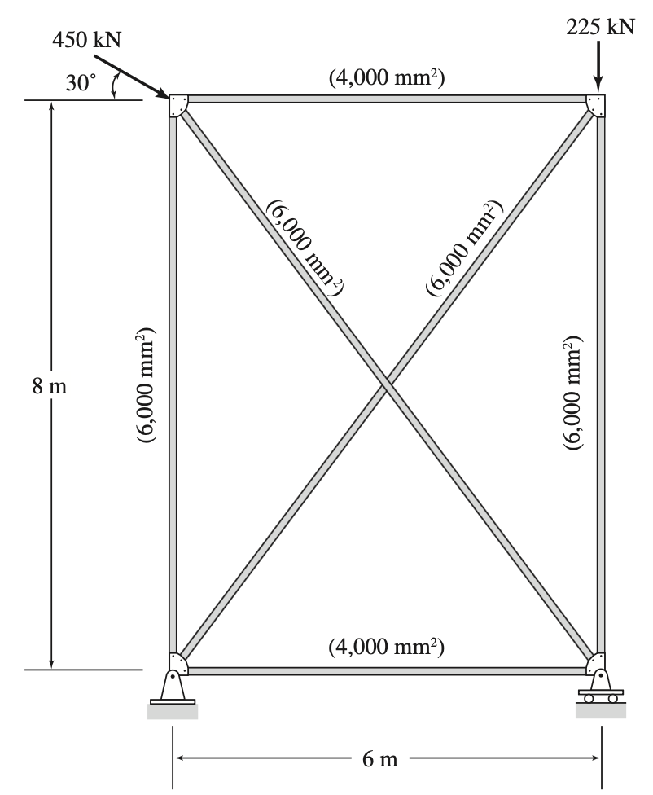
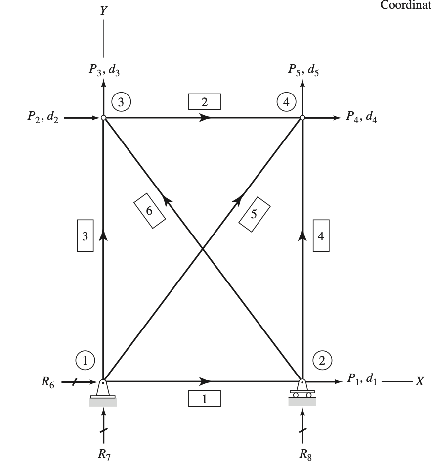

# CEE6501 — Written Assignment, Week 3， Siyuan Wang

## Question 1 — Structural Idealization

For the structure shown above:

1. Number the **joints (nodes)** on the figure.
2. Number the **members (elements)**.
3. Assign **global degree-of-freedom (DOF) numbers** at each node.
4. Identify the **DOF types** using the following notation:
   - Circle: free (unknown) DOFs
   - Box: DOFs with applied loads
   - Underline: restrained DOFs (reaction forces)
5. Write the **global displacement vector**, $\boldsymbol{u}$.
6. Write the **global force vector**, $\boldsymbol{f}$.

## Solution for Question 1

1. Number the **joints (nodes)** on the figure.
2. Number the **members (elements)**.
3. Assign **global degree-of-freedom (DOF) numbers** at each node.
4. Identify the **DOF types** using the following notation:
   - Circle: free (unknown) DOFs
   - Box: DOFs with applied loads
   - Underline: restrained DOFs (reaction forces)

5. Write the **global displacement vector**, $\boldsymbol{u}$.

$$
\mathbf{u}=
\begin{bmatrix}
d_1\\d_2\\d_3\\d_4\\d_5\\0\\0\\0
\end{bmatrix}
$$

6. Write the **global force vector**, $\boldsymbol{f}$.

$$
\mathbf{f}=
\begin{bmatrix}
0\\389.7\\-225\\0\\-225\\R_6\\R_7\\R_8
\end{bmatrix}
kN
$$

## Question 2 — Transformation Matrices

Calculate the **transformation matrix**, $\boldsymbol{T}$, for the following members:

1. **Diagonal member**  
   Start node: top left  
   End node: bottom right
2. **Vertical member**  
   Start node: bottom left  
   End node: top left
3. **Horizontal member**  
   Start node: top right  
   End node: top left

**Note:**  
The angle, $\theta$, is measured as the counter-clockwise rotation from the global $x$-axis (horizontal, positive to the
right) to the local $x$-axis of the element.

## Solution for Question 2

Calculate the **transformation matrix**, $\boldsymbol{T}$, for the following members:

1. **Diagonal member**

$$
\sin\theta= -\frac{4}{5}
\qquad
\cos\theta= \frac{3}{5}
$$

$$
\boldsymbol{T}
=
\begin{bmatrix}
\cos\theta & \sin\theta & 0 & 0\\
-\sin\theta & \cos\theta & 0 & 0\\
0 & 0 & \cos\theta & \sin\theta\\
0 & 0 & -\sin\theta & \cos\theta
\end{bmatrix}
=
\begin{bmatrix}
\frac{3}{5} & -\frac{4}{5} & 0 & 0\\
\frac{4}{5} & \frac{3}{5} & 0 & 0\\
0 & 0 & \frac{3}{5} & -\frac{4}{5}\\
0 & 0 & \frac{4}{5} & \frac{3}{5}
\end{bmatrix}
$$

2. **Vertical member**

$$
\sin\theta= 1
\qquad
\cos\theta= 0
$$

$$
\boldsymbol{T}
=
\begin{bmatrix}
\cos\theta & \sin\theta & 0 & 0\\
-\sin\theta & \cos\theta & 0 & 0\\
0 & 0 & \cos\theta & \sin\theta\\
0 & 0 & -\sin\theta & \cos\theta
\end{bmatrix}
=
\begin{bmatrix}
0 & 1 & 0 & 0\\
-1 & 0 & 0 & 0\\
0 & 0 & 0 & 1\\
0 & 0 & -1 & 0
\end{bmatrix}
$$

3. **Horizontal member**

$$
\sin\theta= 0
\qquad
\cos\theta= -1
$$

$$
\boldsymbol{T}
=
\begin{bmatrix}
\cos\theta & \sin\theta & 0 & 0\\
-\sin\theta & \cos\theta & 0 & 0\\
0 & 0 & \cos\theta & \sin\theta\\
0 & 0 & -\sin\theta & \cos\theta
\end{bmatrix}
=
\begin{bmatrix}
-1 & 0 & 0 & 0\\
0 & -1 & 0 & 0\\
0 & 0 & -1 & 0\\
0 & 0 & 0 & -1
\end{bmatrix}
$$

## Question 3 — Global Stiffness Matrix

Compute the **global stiffness matrix** for all elements from Question 2.

- For the **diagonal member**, derive the global stiffness matrix using **matrix multiplication** and show that it
  matches the **closed-form expression** presented on **Slide 21 of Lecture 3.2**.
- For the remaining members, it is sufficient to present the **closed-form solutions** directly.

## Solution for Question 3

1. **Diagonal member**

$$
\boldsymbol{K} = \boldsymbol{T}^{\mathsf{T}}\,\boldsymbol{k}\,\boldsymbol{T} \\
\\[10pt]
\boldsymbol{K} = \frac{EA}{L}
\begin{bmatrix}
\frac{3}{5} & \frac{4}{5} & 0 & 0\\[2pt]
-\frac{4}{5} & \frac{3}{5} & 0 & 0\\[2pt]
0 & 0 & \frac{3}{5} & \frac{4}{5}\\[2pt]
0 & 0 & -\frac{4}{5} & \frac{3}{5}
\end{bmatrix}
\begin{bmatrix}
1 & 0 & -1 & 0\\[2pt]
0 & 0 & 0 & 0\\[2pt]
-1 & 0 & 1 & 0\\[2pt]
0 & 0 & 0 & 0
\end{bmatrix}
\begin{bmatrix}
\frac{3}{5} & -\frac{4}{5} & 0 & 0\\[2pt]
\frac{4}{5} & \frac{3}{5} & 0 & 0\\[2pt]
0 & 0 & \frac{3}{5} & -\frac{4}{5}\\[2pt]
0 & 0 & \frac{4}{5} & \frac{3}{5}
\end{bmatrix}
\\[10pt]
= \frac{EA}{L}
\begin{bmatrix}
\frac{9}{25} & -\frac{12}{25} & -\frac{9}{25} & \frac{12}{25}\\[2pt]
-\frac{12}{25} & \frac{16}{25} & \frac{12}{25} & -\frac{16}{25}\\[2pt]
-\frac{9}{25} & \frac{12}{25} & \frac{9}{25} & -\frac{12}{25}\\[2pt]
\frac{12}{25} & -\frac{16}{25} & -\frac{12}{25} & \frac{16}{25}
\end{bmatrix}
$$

2. **Vertical member**

$$
\boldsymbol{K} = \boldsymbol{T}^{\mathsf{T}}\,\boldsymbol{k}\,\boldsymbol{T} \\
\\[10pt]
\boldsymbol{K} = \frac{EA}{L}
\begin{bmatrix}
0 & -1 & 0 & 0\\[2pt]
1 & 0 & 0 & 0\\[2pt]
0 & 0 & 0 & -1\\[2pt]
0 & 0 & 1 & 0
\end{bmatrix}
\begin{bmatrix}
1 & 0 & -1 & 0\\[2pt]
0 & 0 & 0 & 0\\[2pt]
-1 & 0 & 1 & 0\\[2pt]
0 & 0 & 0 & 0
\end{bmatrix}
\begin{bmatrix}
0 & 1 & 0 & 0\\[2pt]
-1 & 0 & 0 & 0\\[2pt]
0 & 0 & 0 & 1\\[2pt]
0 & 0 & -1 & 0
\end{bmatrix}
\\[10pt]
= \frac{EA}{L}
\begin{bmatrix}
0 & 0 & 0 & 0\\[2pt]
0 & 1 & 0 & -1\\[2pt]
0 & 0 & 0 & 0\\[2pt]
0 & -1 & 0 & 1
\end{bmatrix}
$$

3. **Horizontal member**

$$
\boldsymbol{K} = \boldsymbol{T}^{\mathsf{T}}\,\boldsymbol{k}\,\boldsymbol{T} \\
\\[10pt]
\boldsymbol{K} = \frac{EA}{L}
\begin{bmatrix}
-1 & 0 & 0 & 0\\[2pt]
0 & -1 & 0 & 0\\[2pt]
0 & 0 & -1 & 0\\[2pt]
0 & 0 & 0 & -1
\end{bmatrix}
\begin{bmatrix}
1 & 0 & -1 & 0\\[2pt]
0 & 0 & 0 & 0\\[2pt]
-1 & 0 & 1 & 0\\[2pt]
0 & 0 & 0 & 0
\end{bmatrix}
\begin{bmatrix}
-1 & 0 & 0 & 0\\[2pt]
0 & -1 & 0 & 0\\[2pt]
0 & 0 & -1 & 0\\[2pt]
0 & 0 & 0 & -1
\end{bmatrix}
\\[10pt]
= \frac{EA}{L}
\begin{bmatrix}
1 & 0 & -1 & 0\\[2pt]
0 & 0 & 0 & 0\\[2pt]
-1 & 0 & 1 & 0\\[2pt]
0 & 0 & 0 & 0
\end{bmatrix}
$$

## Question 4 — Unit Displacement Method

Using the **unit displacement method** described on **Slide 23**, derive the **second column** of the global stiffness
matrix for a truss element.

## Solution for Question 4

- Impose $v_2 = 1$, all other global displacements zero

$$
v_2=1,\qquad v_1=v_3=v_4=0
$$

So:

$$
\boldsymbol{v}=
\begin{bmatrix}
0\\1\\0\\0
\end{bmatrix}
$$

- Project the resulting axial deformation onto the member axis

Axial displacement (along local $x'$) at each node:

$$
u_i' = v_1\cos\theta + v_2\sin\theta
$$

$$
u_j' = v_3\cos\theta + v_4\sin\theta
$$

Substitute $v_2=1,\ v_1=v_3=v_4=0$:

$$
u_i' = 0\cdot\cos\theta + 1\cdot\sin\theta=\sin\theta
$$

$$
u_j' = 0
$$

Axial relative extension (positive in the $j-i$ direction):

$$
\delta = u_j' - u_i' = 0-\sin\theta=-\sin\theta
$$

- Resolve the axial force back into global components

$$
N=k\,\delta=\frac{EA}{L}(-\sin\theta)= -\frac{EA}{L}\sin\theta
$$

Global nodal force at node $i$:

$$
\boldsymbol{F_i}=N
\begin{bmatrix}
-\cos\theta\\
-\sin\theta
\end{bmatrix}
$$

Global nodal force at node $j$:

$$
\boldsymbol{F_j}=N
\begin{bmatrix}
\ \cos\theta\\
\ \sin\theta
\end{bmatrix}
$$

With $N=-\dfrac{EA}{L}\sin\theta$, the force components are:

$$
F_1 = \frac{EA}{L}\cos\theta\sin\theta
$$

$$
F_2 = \frac{EA}{L}\sin^2\theta
$$

$$
F_3 = -\frac{EA}{L}\cos\theta\sin\theta
$$

$$
F_4 = -\frac{EA}{L}\sin^2\theta
$$

Therefore, for $\boldsymbol{v}=[0,1,0,0]^T$:

$$
\boldsymbol{F}=
\begin{bmatrix}
F_1\\F_2\\F_3\\F_4
\end{bmatrix}
=
\frac{EA}{L}
\begin{bmatrix}
\cos\theta\sin\theta\\
\sin^2\theta\\
-\cos\theta\sin\theta\\
-\sin^2\theta
\end{bmatrix}
$$
